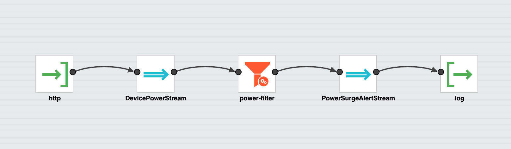
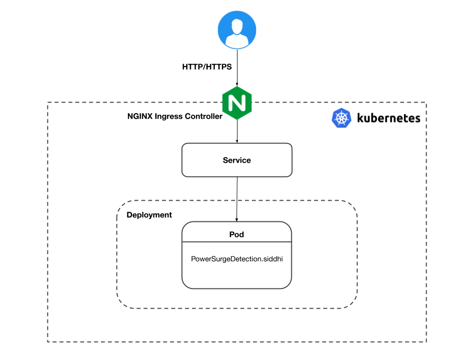

This scenario presents how to deploy and run a stateless Siddhi Application on Kubernetes that receives HTTP requests and logs them. 

This scenario is implemented using the `PowerSurgeDetection` app presented below.

```sql
@App:name("PowerSurgeDetection")
@App:description("Consumes HTTP messages in JSON format and logs them, if the device type is 'dryer', and the power level is >= 600W.")

@source( type='http', 
         receiver.url='${RECEIVER_URL}',
         basic.auth.enabled='false', 
         @map(type='json'))
define stream DevicePowerStream(
              deviceType string, power int);

@sink(type='log', prefix='LOGGER')  
define stream PowerSurgeAlertStream(
              deviceType string, power int);

@info(name='power-filter')  
from DevicePowerStream[deviceType == 'dryer' 
                       and power >= 600] 
select deviceType, power  
insert into PowerSurgeAlertStream;
```



The above app consumes `JSON` messages via HTTP sink in the format `{ 'deviceType': 'dryer', 'power': 6000 }`, and inserts them into `DevicePowerStream` stream. From which the `surge-detector` query filters the events having device type `dryer` and the power consumption amount greater than or equals to `600`W, and inserts them into the `PowerSurgeAlertStream` stream. The `PowerSurgeAlertStream` stream then logs them on the console using a log sink.

This app is stateless as it only has an HTTP source to consume events, a filter query, and a log sink.

For more information in developing Siddhi Apps, refer the [Siddhi Documentation](http://siddhi.io/redirect/docs).

**Prerequisites for deploying the app**

- **Ingress** - As the app consumes events via HTTP, and Siddhi uses NGINX ingress controller to receive HTTP/HTTPS requests.
- **Siddhi Operator** - For deploying and managing Siddhi Apps on Kubernetes.

**Deployment Architecture**

The deployment architecture of the `PowerSurgeDetection` App will be as follows. 



Here, the HTTP/HTTPS requests to the Siddhi App are sent through the NGINX ingress controller.

The next section provides instructions on installing the prerequisites.
